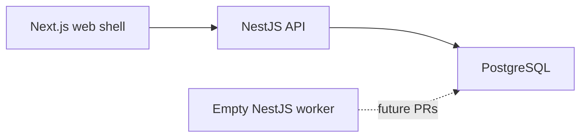

# PR 1 Foundation Architecture

## Boundary

This change provides only the runtime and engineering foundation approved for PR 1.

It deliberately contains:

- no business Prisma models or migrations;
- no catalog or mock business data;
- no authentication or authorization;
- no business routes or screens;
- no pricing, workflows, files, PDFs, notifications, or outbox jobs;
- no code copied from the supplied HTML prototype;
- no LocalStorage business state.

## Runtime topology

The worker is intentionally idle. Later PRs will assign PDF, import, export, notification, and
outbox responsibilities without changing the process boundary.

## Health semantics

- `/api/v1/health/live` does not access PostgreSQL. It verifies only that the API can answer HTTP.
- `/api/v1/health/ready` executes `SELECT 1` through Prisma and the PostgreSQL driver adapter.
- Database failure is normalized into a `503 DATABASE_UNAVAILABLE` API error.

## Request tracing

The API accepts `X-Request-Id` only when it is a valid UUID. Otherwise it creates a UUID and:

1. stores it on the Express request;
2. makes it available through asynchronous request context;
3. returns it in the response header;
4. includes it in completion and error logs;
5. includes it in every normalized API error.

## OpenAPI

NestJS decorators generate the OpenAPI document. Swagger UI is available only outside production
when `OPENAPI_ENABLED=true`. CI can run `pnpm openapi:generate`; the generated file is an artifact
and is not treated as handwritten source.

## Database boundary

Prisma 7 is configured with the PostgreSQL driver adapter. `schema.prisma` intentionally contains
no models. PR 2 will add the V3-aligned business schema, migrations, and seeds.
